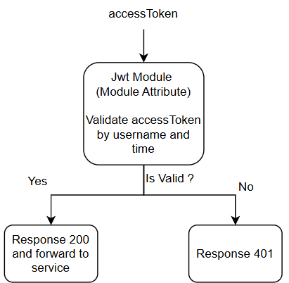
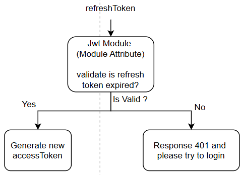

SPRING JWT AUTHENTICATION WITH ACCESS TOKEN AND REFRESH TOKEN

[Program Flow ](https://drive.google.com/file/d/1yzPHbWcsAEQc5I9HZZRfOeQeaP6hsAz-/view?usp=sharing):
---

Access Token Flow:
---

Refresh Token Flow:
---

<b>Request Client auth:</b>\n

Request who doesn't need authorization bearer token in the headers. It just need to bring payload if it needed.

Request Client non-auth:
Request who need authorization bearer token in the header. It just need to bring payload if it needed.

class JwtRequestFilter:
have 3 attributes: handlerExceptionResolver(<b>HandlerExceptionResolver</b>), userDetailsService(<b>MyUsersDetailService</b>), jwtService(<b>JwtService</b>).

1. HandlerExceptionResolver\n

for doing handling error if the request generate error.

2. MyUsersDetailService\n

Base class for users table, it has some base function for authenticating like loadUserByUsername.

3. JwtService\n

Base class for generating and extracting accessToken. The access token is an encrypted string which contain expiredDate, userName, and Encryption Algorithm (HS256) with secret key.

## Access Documentation:
*http://localhost:63342/spring-boot-jwt/*